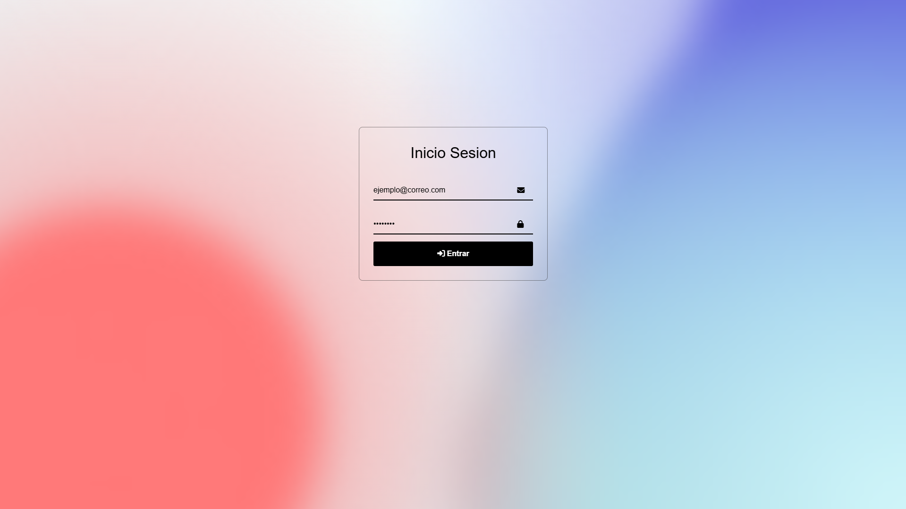
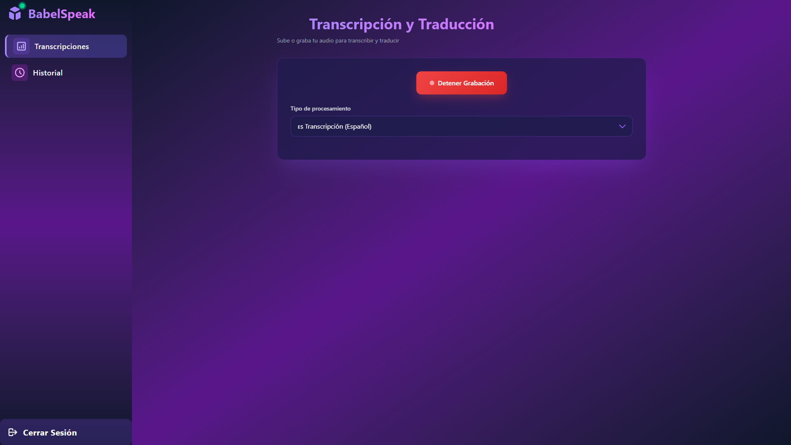
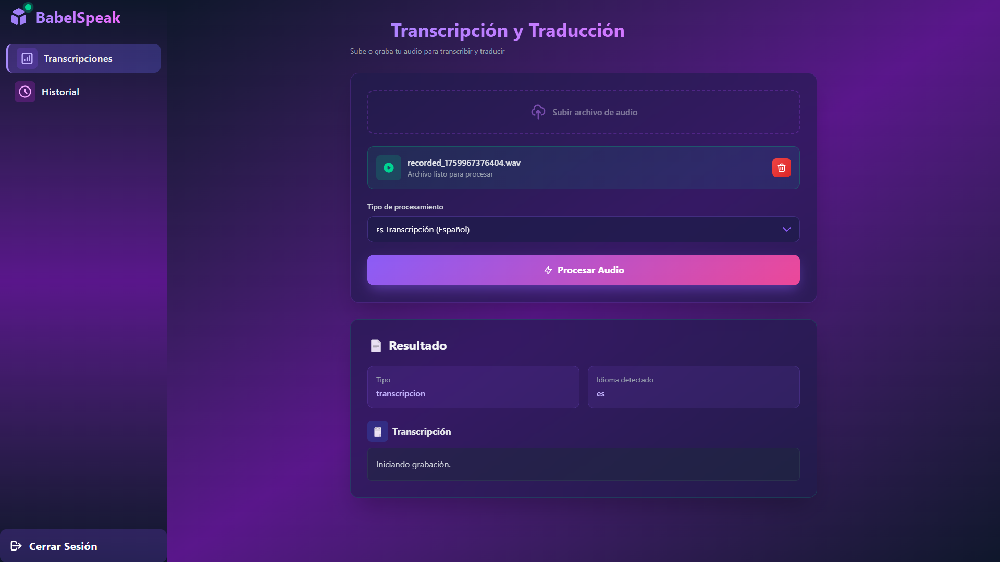
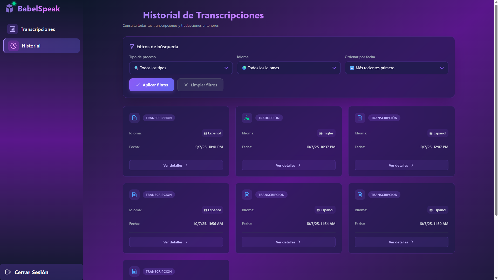

# 🗣️ BabelSpeak

BabelSpeak es una aplicación web desarrollada con Angular que permite transcribir y traducir audio en tiempo real. Utiliza Appwrite como backend y se integra con [BabelFunctions](https://github.com/YamiDarknezz/BabelFunctions) para el procesamiento de audio mediante inteligencia artificial.

## ✨ Características

- 🎙️ **Grabación de audio en tiempo real**
- 📤 **Carga de archivos de audio**
- 📝 **Transcripción automática** de audio en español
- 🌐 **Traducción automática** de inglés a español con transcripción incluida
- 📊 **Historial de transcripciones y traducciones**
- 🔐 **Autenticación segura con Appwrite**
- 💻 **Interfaz intuitiva con dashboard y sidebar**

## 🛠️ Tecnologías

- **Frontend:** Angular
- **Backend:** Appwrite
- **Procesamiento:** [BabelFunctions](https://github.com/YamiDarknezz/BabelFunctions)
- **Storage:** Appwrite Storage
- **Database:** Appwrite Database

## 📋 Requisitos Previos

- Node.js (v16 o superior)
- Angular CLI
- Cuenta de Appwrite (cloud o self-hosted)
- Repositorio [BabelFunctions](https://github.com/YamiDarknezz/BabelFunctions) configurado

## 🚀 Configuración del Proyecto

### 1. Configurar Appwrite

#### Crear Proyecto

1. Accede a tu consola de Appwrite
2. Crea un nuevo proyecto
3. Anota el **Project ID**

#### Configurar Database

1. Crea una nueva base de datos
2. Dentro de la base de datos, crea una colección llamada `transcripciones` (o el nombre que prefieras)
3. Configura los siguientes atributos:

| Atributo     | Tipo     | Tamaño | Requerido |
| ------------ | -------- | ------ | --------- |
| `user_id`    | String   | -      | ✅ Sí     |
| `tipo`       | String   | -      | ✅ Sí     |
| `idioma`     | String   | -      | ✅ Sí     |
| `fecha_hora` | DateTime | -      | ✅ Sí     |

4. Configura los permisos de la colección según tus necesidades
5. Anota el **Database ID** y **Collection ID**

#### Configurar Storage

1. Ve a la sección de **Storage**
2. Crea un nuevo bucket para almacenar los archivos de audio
3. Configura los permisos apropiados (lectura/escritura para usuarios autenticados)
4. Anota el **Bucket ID**

#### Configurar Function

1. Sigue las instrucciones del repositorio [BabelFunctions](https://github.com/YamiDarknezz/BabelFunctions) para desplegar la función en Appwrite
2. Una vez desplegada, anota el **Function ID**

#### Configurar Authentication

1. Ve a la sección de **Auth** en Appwrite
2. Habilita los métodos de autenticación que desees (Email/Password recomendado)
3. Crea los usuarios que tendrán acceso a la aplicación

### 2. Configurar el Proyecto Angular

#### Clonar el Repositorio

```bash
git clone https://github.com/YamiDarknezz/BabelSpeak.git
cd BabelSpeak
```

#### Instalar Dependencias

```bash
npm install
```

#### Configurar Variables de Entorno

1. Crea un archivo `.env` en la raíz del proyecto
2. Agrega las siguientes variables con los datos obtenidos de Appwrite:

```env
NG_APP_APPWRITE_ENDPOINT=https://api.tu-url.com/v1
NG_APP_APPWRITE_PROJECT=PROYECTO_ID_AQUI
NG_APPWRITE_BUCKET_ID=BUCKET_ID_AQUI
NG_APPWRITE_BABEL_FUNCTION_ID=FUNCTION_ID_AQUI
```

**Ejemplo:**

```env
NG_APP_APPWRITE_ENDPOINT=https://cloud.appwrite.io/v1
NG_APP_APPWRITE_PROJECT=64f8a3b2e9d1c
NG_APPWRITE_BUCKET_ID=64f8a4c5f2a3b
NG_APPWRITE_BABEL_FUNCTION_ID=64f8a5d6g3b4c
```

### 3. Ejecutar la Aplicación

#### Modo Desarrollo

```bash
ng serve
```

La aplicación estará disponible en `http://localhost:4200`

#### Modo Producción

```bash
ng build --configuration production
```

Los archivos compilados estarán en la carpeta `dist/`

## 📱 Uso de la Aplicación

### Login

1. Accede a la aplicación con las credenciales del usuario creado en Appwrite
2. Si no tienes usuario, solicita al administrador que cree uno desde la consola de Appwrite

### Dashboard Principal

Una vez autenticado, verás el dashboard con dos secciones principales:

#### 🎙️ Transcripciones (Página Principal)

- **Grabar Audio:** Utiliza el botón de grabación para capturar audio en tiempo real
- **Subir Archivo:** Carga un archivo de audio desde tu dispositivo
- **Seleccionar Tipo:**
  - **Transcribir:** Si el audio está en español, obtendrás solo la transcripción
  - **Traducir:** Si el audio está en inglés, obtendrás la transcripción en inglés y la traducción al español
- **Enviar:** Procesa el audio y espera los resultados

#### 📜 Historial

- Visualiza todas tus transcripciones y traducciones previas
- Revisa la fecha y hora de cada proceso
- Filtra por tipo de operación (transcripción/traducción)

## 🔧 Estructura del Proyecto

```
BabelSpeak/
├── public/
│   └── index.html
├── screenshots/
├── src/
│   ├── app/
│   │   ├── core/
│   │   │   └── services/
│   │   │       ├── auth/
│   │   │       ├── databases/
│   │   │       ├── functions/
│   │   │       ├── storage/
│   │   │       └── appwrite.config.ts
│   │   ├── features/
│   │   │   ├── auth-login/
│   │   │   └── dashboard/
│   │   │       ├── dashboard/
│   │   │       ├── modules/
│   │   │       │   ├── history/
│   │   │       │   └── translator/
│   │   │       └── sidebar/
│   │   ├── app.config.ts
│   │   ├── app.html
│   │   ├── app.routes.ts
│   │   ├── app.scss
│   │   └── app.ts
│   └── env.d.ts
├── .env
├── README.md
└── angular.json
```

## 🤝 Contribuir

Las contribuciones son bienvenidas. Por favor:

1. Fork el proyecto
2. Crea una rama para tu feature (`git checkout -b feature/AmazingFeature`)
3. Commit tus cambios (`git commit -m 'Add: nueva característica'`)
4. Push a la rama (`git push origin feature/AmazingFeature`)
5. Abre un Pull Request

## 📄 Licencia

Este proyecto está bajo la Licencia MIT. Ver el archivo `LICENSE` para más detalles.

## 👥 Autores

- **YamiDarknezz** - [GitHub](https://github.com/YamiDarknezz)

## 🔗 Enlaces Relacionados

- [BabelFunctions](https://github.com/YamiDarknezz/BabelFunctions) - Repositorio de funciones backend
- [Appwrite Documentation](https://appwrite.io/docs)
- [Angular Documentation](https://angular.io/docs)

## 📸 Capturas de Pantalla

### Pantalla de Login

<!-- Agregar imagen aquí -->



### Inicio

<!-- Agregar imagen aquí -->


### Grabación de Audio

<!-- Agregar imagen aquí -->



### Resultado de Grabación

<!-- Agregar imagen aquí -->



### Historial de Transcripciones

<!-- Agregar imagen aquí -->



---

⭐ Si este proyecto te fue útil, no olvides darle una estrella en GitHub
